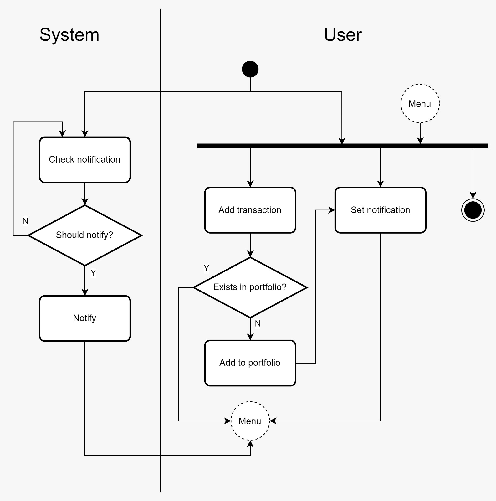
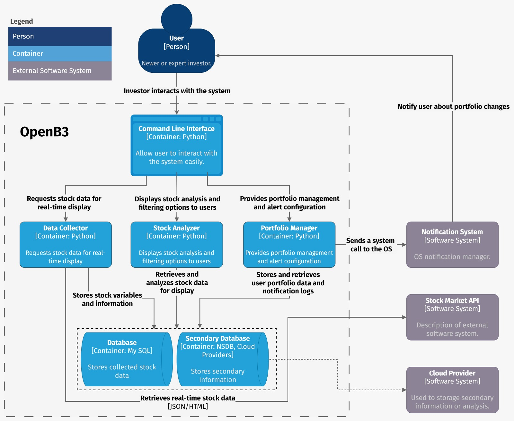
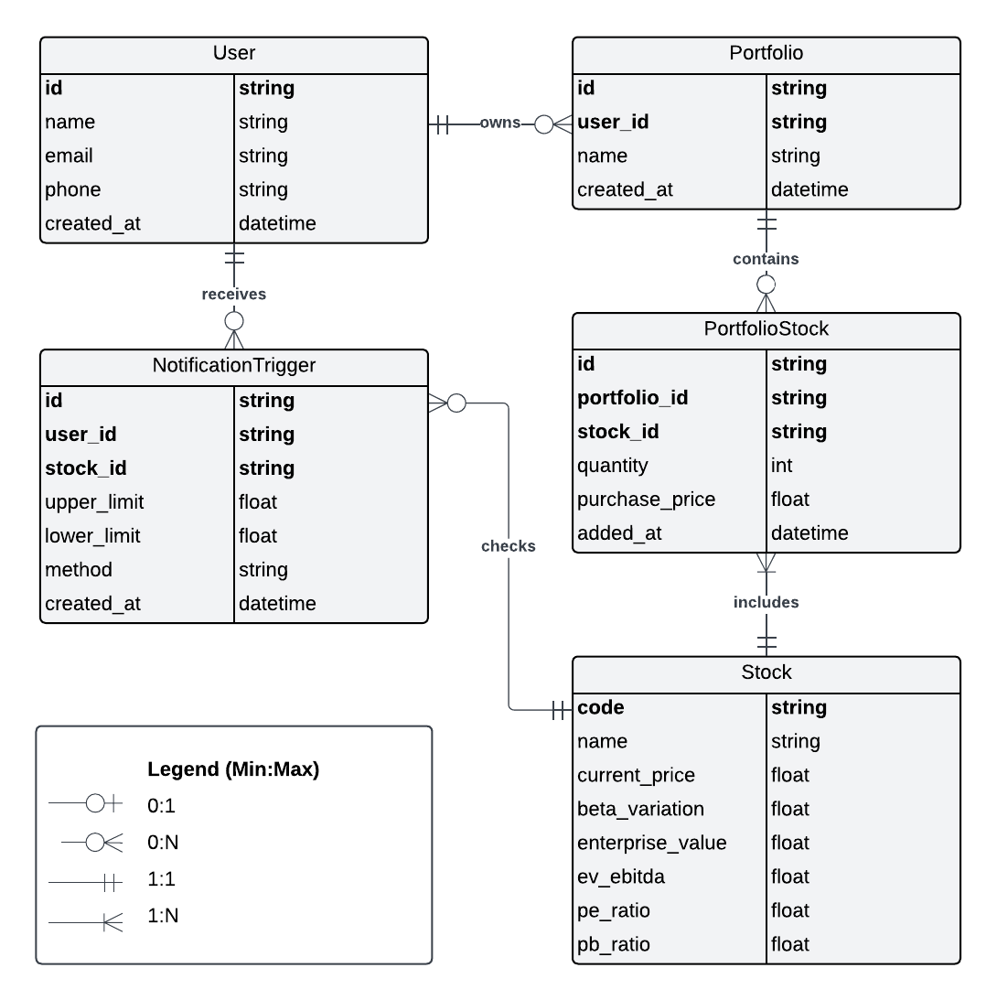

<style>
    *{
        font-family: 'Open Sans', sans-serif;
        color: #1f1f1f;
    }

    td{
        text-align: center;
    }

    table{
        align-content: center;
        width: 100%;
        height: 240px;
        margin: auto;
        padding: auto;
    }

    .logo-text{
        font-family: 'Open Sans', sans-serif;
        color: #000000;
        font-weight: bold;
        font-size: 30px;
    }

    .list{
        display: flex;
        flex-direction: row;
        justify-content: space-between;
        list-style-type: none;
        width: 520px;
        background-color: #f1f5f1;
        margin: 20px;
        padding: 20px;
    }

    .list-item{
        margin: 0px;
    }
</style>

<center>    
  
  <p class="logo-text">build your future.</p>
  <ul class="list">
    <li style="margin: 0px"> <a href="#system-planning-and-methodology">Methodology</a></li>
    <li style="margin: 0px"> <a href="#requirements-elicitation">Requirements elicitation</a></li>
    <li style="margin: 0px"> <a href="#use-cases">Use cases</a></li>
    <li style="margin: 0px"> <a href="#activity-diagram">Diagramming</a></li>
  </ul>
</center>

---

## [DELIVERED] SET/2 (09/17/2024 - 10/01/2024)
<details>

In this sprint, the team focused on two main activities:
- Understand and investigate fundamental technologies besides project demand;
- Plan and organize a workflow for the project.

## System planning and methodology

### Software Architecture
The project is divided into three main components:

#### DataCollector
- Gets current pricing from B3 market stocks
- Collects data analytics 

#### PortfolioManager
- Data collection
- Notify the user of the changes in the portfolio

#### StockAnalyzer
- Show data analytics
- Allow filtering by criteria
- Helps with some basic calculations

### Development Methodology
The project is architected with multiple predefined and independent components. The development team opted for a parallel development methodology.This approach allows for simultaneous development efforts, facilitating faster progress and responsiveness to project requirements.

This decision aligns with the principles outlined in Systems Analysis & Design (A. Dennis, 5th edition), as the project is robust, the requirements are well-established, the technology is familiar, and the timeline demands short-time delivery.

### Planning 
The goal of this project is to complete the first beta version by mid-December, and we will provide biweekly reports to track our progress. This regular reporting will ensure that all stakeholders are kept informed and can provide timely feedback throughout the development process.

During the first sprint, the team will focus on solidifying the project's concept. This includes gathering and analyzing requirements, which will help us understand the needs of our users and define the scope of the project. Additionally, we will concentrate on defining the system architecture and selecting a suitable development methodology that aligns with our project goals and team capabilities.

In subsequent sprints, we plan to release stable versions of each module sequentially, starting with the NOV/1 delivery. This phased approach will allow us to gather more attention to each sub-project, evaluating User Experience (UX) and preventing bugs. Our objective is to reach version 0.1.0 of the project by DEC/1, marking a significant milestone in our development timeline.

|----------------|OCT/1|OCT/2|NOV/1|NOV/2|DEC/1|
|----------------|-----|-----|-----|-----|-----|
|DataCollector   |  x  |  x  |  x  |     |     |
|PortfolioManager|  x  |  x  |  x  |  x  |     |
|StockAnalyzer   |     |  x  |  x  |  x  |  x  |

### Team
The development team is composed of Diogo Monteiro.

</details>


## [DELIVERED] OCT/1 (10/01/2024 - 10/15/2024)
<details>

In this sprint, the team focused on two main activities:
- Defining the primary requirements;
- Elaborate some use cases to better understand the overall workflow.


## Requirements Elicitation
<details>

### Functional Requirements

1. **Data Collecting and Processing:**
    - The system may collect B3's stocks metrics and variables such as current price, beta variation and enterprise value.
    - The system may process this informations, if necessary, to provide other metrics such as EV/EBITDA, P/E and P/B.

2. **Portfolio Managing and Notification:**
    - The system may allow users to CRUD any stock market attributes (except code e.g. ABCD4) or portfolio.
    - The system may warn users when an active has a unnatural price variation.
    - The system may allow users to stablish warning parameters such as top or bottom price or beta variation limit.
    - The system may notify users using email, SMS, pop-up or social media messages. 

3. **Stock Analysis:**
    - The system may show finely stock market analysis. 
    - The system may filter stocks according to parameters set by user, such as price, volume and history.
    - The system may help user to perform manual calculations with their own variables.

4. **The Interface:**
    - The system may have an graceful usability allowing page-transitioning easily between pages. 


### Non-Functional Requirements

1. **Usability:**
    - The system may be easy to use, featuring an intuitive interface that minimizes the learning curve, especially for beginner investors.
    - The system may leave information clearly visible to the user, minimizing "hidden" details.

2. **Performance:**
    - The system may process real-time data with minimal latency, ensuring that analyses are always up-to-date.

3. **Compatibility:**
    - The system may be compatible with major desktop operating systems (Windows, macOS, and Linux).
    - The system may support the use as distinct but integrable modules.

4. **Scalability:**
    - The system may be designed to handle data volume and user scaling without losing performance.

5. **Documentation and Best Practices:**
    - The system's code may be well-documented and modular, facilitating maintenance and the addition of new features in the future.
    - The system may include a *getting started* and *support* section for users, including tutorials and FAQs.

</details>

## Use cases
<details>

### Use Case 1: Add an Stock to the Portfolio
<details>

**Actor:** User  
**Description:** This use case describes how the user adds an stock to the portfolio. The stock can be any stock available in B3.

#### Preconditions
1. The user must be logged into the system.
2. The system must be connected to the internet to access real-time data.

#### Normal Flow
1. The user navigates to the portfolio management section.
2. The user selects the "Add stock" option.
3. The system asks the user to enter the stock code (e.g., PETR4).
4. The user provides transaction details such as quantity and purchase price.
5. The system validates the information and confirms the addition of the stock to the portfolio.
6. The system updates the user's stock list and recalculates the total values.

#### Postconditions
1. The stock is added to the user's portfolio with the provided information.

#### Input/Output
| Inputs              | Source      | Outputs                  | Destination           |
| ------------------- | ----------- | ------------------------ | --------------------- |
| Stock code          | User        | Success confirmation     | User interface        |
| Quantity            | User        | Portfolio update         | Database              |
| Purchase price      | User        | Recalculates total values| Database              |

---
</details>


### Use Case 2: Activate stock Monitoring
<details>

**Actor:** User  
**Description:** This use case describes how the user activates price monitoring for a specific stock.

#### Preconditions
1. The user must be logged into the system.
2. The stock must be listed on the B3 market, but it is not required to be part of the user's portfolio.

#### Normal Flow
1. The user accesses the stock monitoring section.
2. The user selects an stock already in the portfolio.
3. The system asks the user to define alert limits for the stock price.
4. The system activates monitoring and confirms the setup.

#### Postconditions
1. The system starts monitoring the stock according to the defined limits.
2. The user is notified when the stock price reaches the specified values.

#### Input/Output
| Inputs              | Source      | Outputs                    | Destination           |
| ------------------- | ----------- | -------------------------- | --------------------- |
| Upper limit         | User        | Monitoring confirmation    | Database              |
| Lower limit         | User        | Monitoring confirmation    | Database              |

---
</details>


### Use Case 3: Search for stocks by variables
<details>

**Actor:** User  
**Description:** This use case describes how the user searches for stocks on B3 based on financial indexes.

#### Preconditions
1. The user must be logged into the system.
2. The system must have access to updated financial data for the stocks.

#### Normal Flow
1. The user accesses the stock search section.
2. The user selects the search criteria (e.g., P/E Ratio, Dividend Yield).
3. The system processes the request and filters stocks based on the specified criteria.
4. The system displays the list of stocks that match the filters.

#### Postconditions
1. The filtered list of stocks is presented to the user.
2. The user can add any of these stocks to their portfolio or monitor them.

#### Input/Output
| Inputs               | Source      | Outputs                 | Destination           |
| -------------------  | ----------- | ----------------------- | --------------------- |
| Filter criteria      | User        | List of stocks          | User interface        |
| Index values         | System      | Updated data            | User interface        |

---
</details>

</details>

</details>


## [DELIVERED] OCT/2 (10/15/2024 - 11/01/2024)
<details>

## Activity Diagram
Aiming to present the overall functionality of the project, the team created an Activity Diagram using Unified Modeling Language (UML). The diagram outlines the system's main activities, along with key user and system actions, as shown in the image below.



</details>


## [IN PROGRESS] NOV/1 (11/1/2024 - 11/15/2024)
<details>

In this sprint, the team focused on two main activities:
- Understand and formulate a C4 diagram;
- Plan and organize a workflow for the project.


## C4 Diagrams

The C4 model provides a hierarchy and structured way to visualize software architecture by breaking it down into four distinct levels of abstraction: **Context**, **Containers**, **Components**, and **Code**. Each level picturize different amount of fine-graining, from high-level to low-level abstractions, thus, offering a clear perspective on the architecture depending on the level of detail needed.

- Context Diagram: This is the highest-level view, offering a big-picture understanding of the system in relation to its users and external systems. It's useful for non-technical stakeholders to understand how the system interacts with its environment.

- Container Diagram: The next level, which zooms into the system's internal structure, highlighting major applications, services, and databases (known as containers) and their interactions. This is particularly useful for architects and developers to understand the high-level technical structure.

- Component Diagram: Going deeper, the component diagram focuses on the internal structure of a single container, showing its components, their responsibilities, and how they interact. This helps developers see how containers are built.

- Code Diagram: The most detailed level, showing the inner workings of individual components down to the code or class level, useful for developers focusing on implementation.

### Choosing the Appropriate Diagram:

In the context of your project, the Container Diagram is an ideal choice at this stage because our idea is well-developed and technically mature, but not yet explored enough to lower levels of abstraction (coding). Instead, you're focusing on conveying the overall structure of your system—showing how different applications, services, databases, and external systems interact.

The Container Diagram gives a clear, high-level view of how the system is organized into different container, showing them connection and primary functioning (e.g., web application, database, microservices) 

By starting with the Container Diagram, we can provide a technical but high-level representation of the system’s architecture that can be understood by both technical and semi-technical stakeholders. It helps set the stage for further exploration into more detailed technical layers like components and code later in the discussion.

This choice allows you to balance technical depth with clarity, making it an effective middle ground for clients who need to understand how the system is built without getting lost in the finer details of implementation just yet.



## Entity-Relationship Diagram

As start, the team used a the logical model to formulate a previous view of the diagram. The logical model is clear representation of how different entities interact within the system. It helps in organizing data structures and relationships, ensuring that all key  before moving on to more complex diagrams such as UML.

The logical model is essential in defining how data is stored and managed across different system modules. Each entity in the system, such as stocks, portfolios, users, and notifications, is represented as a table, with attributes that map to the necessary data points. These entities are designed to capture essential information such as stock prices, user portfolios, alert limits, and market analysis.

```
Stock (*id, code, name, current_price, beta_variation, enterprise_value, ev_ebitda, pe_ratio, pb_ratio)
Portfolio (*id, user_id, name, created_at)
PortfolioStock (*id, portfolio_id, stock_id, quantity, purchase_price, added_at)
User (*id, name, email, phone, created_at)
```

Notification (*id, user_id, stock_id, upper_limit, lower_limit, method, created_at)
By establishing clear relationships between these entities (such as how a portfolio is linked to its stocks or how notifications are sent to users), we ensure that the system can effectively handle data collection, portfolio management, and stock analysis. The logical model also lays the groundwork for scalability, as additional functionality can easily be integrated into this structured approach.

Below is a reserved space for the UML diagram, which will visually represent the components and their interactions, building upon the logical model to show a more dynamic view of the system.



This diagram will provide a detailed, graphical representation of the system's flow and structure, complementing the logical model with a visual depiction of how the components interact during real-time operations.


</details>
